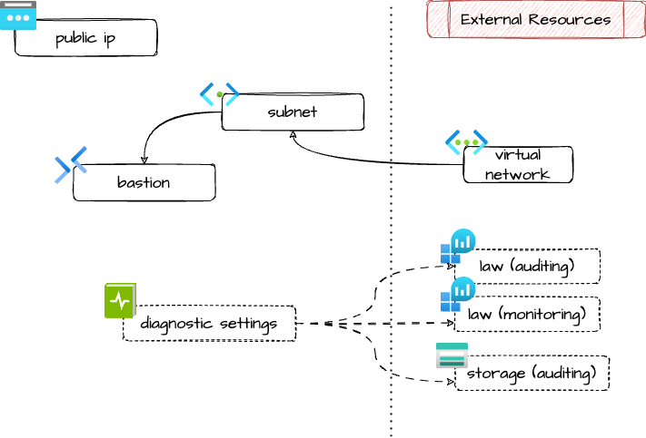

# Azure Bastion

Creates an Azure Bastion host.

## Architecture



## Example usage

```terraform
resource "azurerm_resource_group" "example" {
  name     = "my-rg"
  location = "italynorth"
  tags     = var.tags
}

resource "azurerm_virtual_network" "example" {
  name                = "my-vnet"
  location            = "italynorth"
  location            = azurerm_resource_group.example.location
  resource_group_name = azurerm_resource_group.example.name
  address_space       = ["10.0.0.0/16"]
  tags                = var.tags
}

module "bastion" {
  source = "github.com/pagopa/ict-terraform-modules//azure_bastion?ref=v1.0.0"

  name                    = "my-bastion"
  location                = azurerm_resource_group.example.location
  resource_group_name     = azurerm_resource_group.example.name
  sku                     = "Standard"
  scale_units             = 2
  virtual_network_name    = azurerm_virtual_network.example.name
  subnet_address_prefixes = ["10.0.0.0/26"] # at least /26

  tags = var.tags
}
```

<!-- markdownlint-disable -->
<!-- BEGIN_TF_DOCS -->
## Requirements

| Name | Version |
|------|---------|
| <a name="requirement_terraform"></a> [terraform](#requirement\_terraform) | ~> 1.9 |
| <a name="requirement_azurerm"></a> [azurerm](#requirement\_azurerm) | >= 3.116.0 |

## Providers

| Name | Version |
|------|---------|
| <a name="provider_azurerm"></a> [azurerm](#provider\_azurerm) | 4.29.0 |

## Modules

No modules.

## Resources

| Name | Type |
|------|------|
| [azurerm_bastion_host.this](https://registry.terraform.io/providers/hashicorp/azurerm/latest/docs/resources/bastion_host) | resource |
| [azurerm_monitor_diagnostic_setting.auditing_law](https://registry.terraform.io/providers/hashicorp/azurerm/latest/docs/resources/monitor_diagnostic_setting) | resource |
| [azurerm_monitor_diagnostic_setting.auditing_storage](https://registry.terraform.io/providers/hashicorp/azurerm/latest/docs/resources/monitor_diagnostic_setting) | resource |
| [azurerm_monitor_diagnostic_setting.monitoring_law](https://registry.terraform.io/providers/hashicorp/azurerm/latest/docs/resources/monitor_diagnostic_setting) | resource |
| [azurerm_public_ip.bastion](https://registry.terraform.io/providers/hashicorp/azurerm/latest/docs/resources/public_ip) | resource |
| [azurerm_subnet.bastion](https://registry.terraform.io/providers/hashicorp/azurerm/latest/docs/resources/subnet) | resource |

## Inputs

| Name | Description | Type | Default | Required |
|------|-------------|------|---------|:--------:|
| <a name="input_auditing_log_analytics_workspace_id"></a> [auditing\_log\_analytics\_workspace\_id](#input\_auditing\_log\_analytics\_workspace\_id) | ID of the log analytics workspace used for auditing purposes | `string` | `null` | no |
| <a name="input_auditing_storage_account_id"></a> [auditing\_storage\_account\_id](#input\_auditing\_storage\_account\_id) | ID of the storage account used for auditing purposes | `string` | `null` | no |
| <a name="input_location"></a> [location](#input\_location) | Location | `string` | n/a | yes |
| <a name="input_monitoring_log_analytics_workspace_id"></a> [monitoring\_log\_analytics\_workspace\_id](#input\_monitoring\_log\_analytics\_workspace\_id) | ID of the log analytics workspace used for monitoring purposes | `string` | `null` | no |
| <a name="input_name"></a> [name](#input\_name) | Name of the bastion | `string` | n/a | yes |
| <a name="input_public_ip_id"></a> [public\_ip\_id](#input\_public\_ip\_id) | ID of the public ip to attach to the bastion; if null, a new one will be created | `string` | `null` | no |
| <a name="input_resource_group_name"></a> [resource\_group\_name](#input\_resource\_group\_name) | Resource group name | `string` | n/a | yes |
| <a name="input_scale_units"></a> [scale\_units](#input\_scale\_units) | Scale units of the bastion, leave default for most use cases | `number` | `2` | no |
| <a name="input_sku"></a> [sku](#input\_sku) | Sku of the bastion | `string` | n/a | yes |
| <a name="input_subnet_address_prefixes"></a> [subnet\_address\_prefixes](#input\_subnet\_address\_prefixes) | CIDRs of the bastion subnet that will be created. Must be at least of size /26 | `list(string)` | n/a | yes |
| <a name="input_tags"></a> [tags](#input\_tags) | Tags of azure resources | `map(string)` | `{}` | no |
| <a name="input_virtual_network_name"></a> [virtual\_network\_name](#input\_virtual\_network\_name) | Name of the VNET in which to deploy the bastion | `string` | n/a | yes |

## Outputs

| Name | Description |
|------|-------------|
| <a name="output_id"></a> [id](#output\_id) | ID of the managed resource |
| <a name="output_public_ip_address"></a> [public\_ip\_address](#output\_public\_ip\_address) | Public IP address of the Bastion, if NOT externally provided |
<!-- END_TF_DOCS -->
