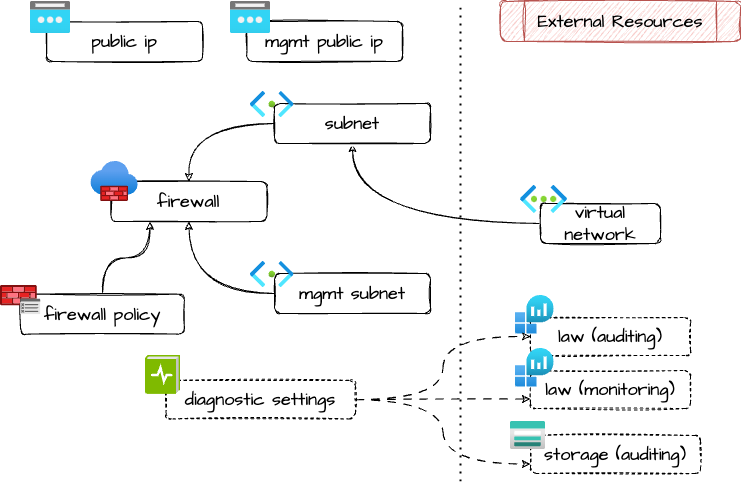

# Azure Firewall

Create an Azure Firewall in a virtual network with forced tunneling.

No firewall rules are managed here.

For details about forced tunneling, read [here](https://learn.microsoft.com/en-us/azure/firewall/forced-tunneling).

> [!NOTE]
> This is mainly used and test with Basic sku: for higher tiers there
> are some other features that are not managed here at the moment!

## Architecture



## Example usage

```terraform
resource "azurerm_resource_group" "example" {
  name     = "my-rg"
  location = "italynorth"
  tags     = var.tags
}

resource "azurerm_virtual_network" "example" {
  name                = "my-vnet"
  location            = "italynorth"
  location            = azurerm_resource_group.example.location
  resource_group_name = azurerm_resource_group.example.name
  address_space       = ["10.0.0.0/16"]
  tags                = var.tags
}

module "firewall" {
  source = "github.com/pagopa/ict-terraform-modules//azure_firewall?ref=v1.0.0"

  base_name                    = "my-afw"
  resource_group_name          = azurerm_resource_group.example.name
  location                     = azurerm_resource_group.example.location
  virtual_network_name         = azurerm_virtual_network.example.name
  subnet_address_prefixes      = ["10.0.1.0/26"]
  mgmt_subnet_address_prefixes = ["10.0.1.64/26"]
  sku_tier                     = "Basic"

  tags = var.tags
}
```

<!-- markdownlint-disable -->
<!-- BEGIN_TF_DOCS -->
## Requirements

| Name | Version |
|------|---------|
| <a name="requirement_terraform"></a> [terraform](#requirement\_terraform) | ~> 1.9 |
| <a name="requirement_azurerm"></a> [azurerm](#requirement\_azurerm) | >= 3.116.0 |

## Providers

| Name | Version |
|------|---------|
| <a name="provider_azurerm"></a> [azurerm](#provider\_azurerm) | 4.33.0 |

## Modules

No modules.

## Resources

| Name | Type |
|------|------|
| [azurerm_firewall.this](https://registry.terraform.io/providers/hashicorp/azurerm/latest/docs/resources/firewall) | resource |
| [azurerm_firewall_policy.this](https://registry.terraform.io/providers/hashicorp/azurerm/latest/docs/resources/firewall_policy) | resource |
| [azurerm_monitor_diagnostic_setting.auditing_law](https://registry.terraform.io/providers/hashicorp/azurerm/latest/docs/resources/monitor_diagnostic_setting) | resource |
| [azurerm_monitor_diagnostic_setting.auditing_storage](https://registry.terraform.io/providers/hashicorp/azurerm/latest/docs/resources/monitor_diagnostic_setting) | resource |
| [azurerm_monitor_diagnostic_setting.monitoring_law](https://registry.terraform.io/providers/hashicorp/azurerm/latest/docs/resources/monitor_diagnostic_setting) | resource |
| [azurerm_public_ip.firewall](https://registry.terraform.io/providers/hashicorp/azurerm/latest/docs/resources/public_ip) | resource |
| [azurerm_public_ip.management](https://registry.terraform.io/providers/hashicorp/azurerm/latest/docs/resources/public_ip) | resource |
| [azurerm_subnet.firewall](https://registry.terraform.io/providers/hashicorp/azurerm/latest/docs/resources/subnet) | resource |
| [azurerm_subnet.management](https://registry.terraform.io/providers/hashicorp/azurerm/latest/docs/resources/subnet) | resource |

## Inputs

| Name | Description | Type | Default | Required |
|------|-------------|------|---------|:--------:|
| <a name="input_auditing_log_analytics_workspace_id"></a> [auditing\_log\_analytics\_workspace\_id](#input\_auditing\_log\_analytics\_workspace\_id) | ID of the log analytics workspace used for auditing purposes | `string` | `null` | no |
| <a name="input_auditing_storage_account_id"></a> [auditing\_storage\_account\_id](#input\_auditing\_storage\_account\_id) | ID of the storage account used for auditing purposes | `string` | `null` | no |
| <a name="input_base_name"></a> [base\_name](#input\_base\_name) | Base name of the managed resources | `string` | n/a | yes |
| <a name="input_firewall_policy_id"></a> [firewall\_policy\_id](#input\_firewall\_policy\_id) | Id of the firewall policy to attach, if null a new one will be provided | `string` | `null` | no |
| <a name="input_location"></a> [location](#input\_location) | Location | `string` | n/a | yes |
| <a name="input_mgmt_subnet_address_prefixes"></a> [mgmt\_subnet\_address\_prefixes](#input\_mgmt\_subnet\_address\_prefixes) | CIDRs of the subnet that will be created for the firewall management | `list(string)` | n/a | yes |
| <a name="input_monitoring_log_analytics_workspace_id"></a> [monitoring\_log\_analytics\_workspace\_id](#input\_monitoring\_log\_analytics\_workspace\_id) | ID of the log analytics workspace used for monitoring purposes | `string` | `null` | no |
| <a name="input_public_ip_domain_name_label"></a> [public\_ip\_domain\_name\_label](#input\_public\_ip\_domain\_name\_label) | Public ip domain name label for reverse DNS lookup | `string` | `null` | no |
| <a name="input_public_ip_reverse_fqdn"></a> [public\_ip\_reverse\_fqdn](#input\_public\_ip\_reverse\_fqdn) | FQDN associated to the firewall public ip for reverse DNS lookup | `string` | `null` | no |
| <a name="input_resource_group_name"></a> [resource\_group\_name](#input\_resource\_group\_name) | Resource group name | `string` | n/a | yes |
| <a name="input_sku_tier"></a> [sku\_tier](#input\_sku\_tier) | SKU tier of the firewall | `string` | n/a | yes |
| <a name="input_subnet_address_prefixes"></a> [subnet\_address\_prefixes](#input\_subnet\_address\_prefixes) | CIDRs of the subnet that will be created for the firewall | `list(string)` | n/a | yes |
| <a name="input_tags"></a> [tags](#input\_tags) | Tags of azure resources | `map(string)` | `{}` | no |
| <a name="input_virtual_network_name"></a> [virtual\_network\_name](#input\_virtual\_network\_name) | Name of the virtual network in which deploy the bastion | `string` | n/a | yes |

## Outputs

| Name | Description |
|------|-------------|
| <a name="output_id"></a> [id](#output\_id) | ID of the managed resource |
| <a name="output_mgmt_public_ip_addresses"></a> [mgmt\_public\_ip\_addresses](#output\_mgmt\_public\_ip\_addresses) | Public ip address of the firewall management |
| <a name="output_policy_id"></a> [policy\_id](#output\_policy\_id) | ID of the firewall policy |
| <a name="output_private_ip_address"></a> [private\_ip\_address](#output\_private\_ip\_address) | Private ip address of the firewall |
| <a name="output_public_ip_addresses"></a> [public\_ip\_addresses](#output\_public\_ip\_addresses) | Public ip address of the firewall |
<!-- END_TF_DOCS -->
