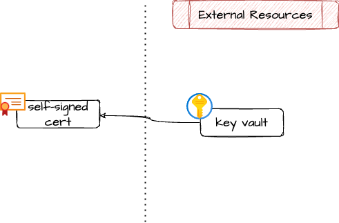

# Azure self-signed certificate on Key Vault

Create a self-signed certificate inside a Key Vault instance.

This is a quick-and-dirty cert to get up and running fast!  This could
be useful for quickly bootstrapping and environment and then replace
with real certificate, or for DEV workloads.

> [!WARNING]
> For obvious reasons: don't use in prod! :smiley:

## Architecture

## Example usage

TODO

<!-- markdownlint-disable -->
<!-- BEGIN_TF_DOCS -->
## Requirements

| Name | Version |
|------|---------|
|  [terraform](#requirement\_terraform) | ~> 1.9 |
|  [azurerm](#requirement\_azurerm) | >= 3.116.0 |

## Providers

| Name | Version |
|------|---------|
|  [azurerm](#provider\_azurerm) | 4.11.0 |

## Modules

No modules.

## Resources

| Name | Type |
|------|------|
| [azurerm_key_vault_certificate.this](https://registry.terraform.io/providers/hashicorp/azurerm/latest/docs/resources/key_vault_certificate) | resource |

## Inputs

| Name | Description | Type | Default | Required |
|------|-------------|------|---------|:--------:|
|  [key\_vault\_id](#input\_key\_vault\_id) | ID of the key vault in which to store the cert | `string` | n/a | yes |
|  [name](#input\_name) | Name of the cert | `string` | n/a | yes |
|  [subject\_cn](#input\_subject\_cn) | CN (common name) of the cert | `string` | n/a | yes |
|  [tags](#input\_tags) | Tag of azure resources | `map(string)` | `{}` | no |

## Outputs

| Name | Description |
|------|-------------|
|  [name](#output\_name) | Name of the self-signed certificate |
|  [secret\_id](#output\_secret\_id) | Secret id of the self-signed certificate |
|  [versionless\_secret\_id](#output\_versionless\_secret\_id) | Versionless secret id of the self-signed certificate |
<!-- END_TF_DOCS -->
