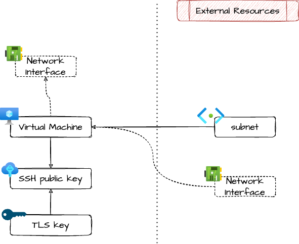

# Azure Linux Virtual Machine

Terraform module to manage a Linux Virtual Machine in Azure with sane opinionated defaults.

By default, the VM will have a private IP and SSH authentication with Entra ID enabled.

> [!NOTE]
> Password authentication is disabled.

> [!NOTE] 
> Private key auhtentication *can* technically be used but it
> is strongly suggested to use Entra ID authentication

## Architecture



## Example usage

This will provision a VM like this:
- private IP
- SSH login with Entra ID authentication via Bastion for Developers and Admin AD groups
- port 443 exposed in the VNET
- no other port exposed not even in the vnet

```terraform
locals {
  project = "exmp-${var.env-short}"
}

resource "azurerm_resource_group" "this" {
  name     = "${local.project}-rg"
  location = var.location
  tags     = var.tags
}

resource "azurerm_virtual_network" {
  name                = "${local.project}-vnet"
  location            = azurerm_resource_group.this.location
  resource_group_name = azurerm_resource_group.this.name
  address_space       = ["10.0.0.0/18"]
  tags                = var.tags
}

module "vm_snet" {
  source = "./modules/vm_subnet/"

  name                 = "${local.project}-vm-snet"
  address_prefixes     = ["10.0.0.0/24"]
  resource_group_name  = azurerm_resource_group.this.name
  location             = azurerm_resource_group.this.location
  virtual_network_name = module.vnet.name

  management_access = {
    type                        = "bastion"
    bastion_resource_group_name = "my-bastion-rg"
    bastion_vnet_name           = "my-bastion-vnet"
    ssh_enabled                 = true
  }

  exposed_services = [
    {
      name                    = "https"
      protocol                = "Tcp"
      port                    = "443"
      source_address_prefixes = ["*"]
    },
  ]
}

module "vm" {
  source = "./modules/linux_virtual_machine/"

  name                = "${local.project}-vm"
  location            = azurerm_resource_group.this.location
  resource_group_name = azurerm_resource_group.this.name

  subnet_id = module.vm_snet.id
  size      = "Standard_B1s"
  
  image_publisher = "Canonical"
  image_offer     = "0001-com-ubuntu-server-jammy"
  image_sku       = "22_04-lts"
  image_version   = "latest"

  aad_ssh_login = {
    enabled = true
  }
  
  azure_monitor_agent = {
    enabled = true
    data_collection_rule_id     = "my rule id..."
    data_collection_endpoint_id = "my endp id..."
  }

  tags = var.tags
}
```

<!-- markdownlint-disable -->
<!-- BEGIN_TF_DOCS -->
## Requirements

| Name | Version |
|------|---------|
| <a name="requirement_terraform"></a> [terraform](#requirement\_terraform) | ~> 1.9 |
| <a name="requirement_azurerm"></a> [azurerm](#requirement\_azurerm) | >= 3.116.0 |
| <a name="requirement_tls"></a> [tls](#requirement\_tls) | >= 4.0.6 |

## Providers

| Name | Version |
|------|---------|
| <a name="provider_azurerm"></a> [azurerm](#provider\_azurerm) | 4.11.0 |
| <a name="provider_tls"></a> [tls](#provider\_tls) | 4.0.6 |

## Modules

No modules.

## Resources

| Name | Type |
|------|------|
| [azurerm_linux_virtual_machine.this](https://registry.terraform.io/providers/hashicorp/azurerm/latest/docs/resources/linux_virtual_machine) | resource |
| [azurerm_network_interface.internal](https://registry.terraform.io/providers/hashicorp/azurerm/latest/docs/resources/network_interface) | resource |
| [azurerm_ssh_public_key.public_key](https://registry.terraform.io/providers/hashicorp/azurerm/latest/docs/resources/ssh_public_key) | resource |
| [tls_private_key.ssh](https://registry.terraform.io/providers/hashicorp/tls/latest/docs/resources/private_key) | resource |

## Inputs

| Name | Description | Type | Default | Required |
|------|-------------|------|---------|:--------:|
| <a name="input_base_name"></a> [base\_name](#input\_base\_name) | Base name of the managed resources | `string` | n/a | yes |
| <a name="input_identity"></a> [identity](#input\_identity) | Identity attached to the VM. Consider leaving the default SystemAssigned, handy in most cases | <pre>object({<br/>    type         = string<br/>    identity_ids = optional(set(string), null)<br/>  })</pre> | <pre>{<br/>  "identity_ids": null,<br/>  "type": "SystemAssigned"<br/>}</pre> | no |
| <a name="input_image_offer"></a> [image\_offer](#input\_image\_offer) | Image offer, see docs of source\_image\_reference group in azurerm\_linux\_virtual\_machine | `string` | n/a | yes |
| <a name="input_image_publisher"></a> [image\_publisher](#input\_image\_publisher) | Image publisher, see docs of source\_image\_reference group in azurerm\_linux\_virtual\_machine | `string` | n/a | yes |
| <a name="input_image_sku"></a> [image\_sku](#input\_image\_sku) | Image sku, see docs of source\_image\_reference group in azurerm\_linux\_virtual\_machine | `string` | n/a | yes |
| <a name="input_image_version"></a> [image\_version](#input\_image\_version) | Image version, see docs of source\_image\_reference group in azurerm\_linux\_virtual\_machine | `string` | n/a | yes |
| <a name="input_index_suffix"></a> [index\_suffix](#input\_index\_suffix) | Index suffix for the VM and related resource, for example set '01' for having a 'test' VM named 'test-vm-01' | `string` | `null` | no |
| <a name="input_location"></a> [location](#input\_location) | Location | `string` | n/a | yes |
| <a name="input_network_interface_ids"></a> [network\_interface\_ids](#input\_network\_interface\_ids) | Network interfaces to attach to the VM. If null, a default one with private IP will be provided | `list(string)` | `null` | no |
| <a name="input_os_disk_caching"></a> [os\_disk\_caching](#input\_os\_disk\_caching) | OS disk caching, see docs of os\_disk group in azurerm\_linux\_virtual\_machine | `string` | `"ReadWrite"` | no |
| <a name="input_os_disk_storage_account_type"></a> [os\_disk\_storage\_account\_type](#input\_os\_disk\_storage\_account\_type) | OS disk storage account type, see docs of os\_disk group in azurerm\_linux\_virtual\_machine | `string` | `"Standard_LRS"` | no |
| <a name="input_private_ip_address"></a> [private\_ip\_address](#input\_private\_ip\_address) | Private ip address if allocation mode is static. Not used when providing network\_interface\_ids | `string` | `null` | no |
| <a name="input_private_ip_address_allocation"></a> [private\_ip\_address\_allocation](#input\_private\_ip\_address\_allocation) | Mode of allocation of private ip. Not used when providing network\_interface\_ids | `string` | `"Dynamic"` | no |
| <a name="input_resource_group_name"></a> [resource\_group\_name](#input\_resource\_group\_name) | Resource group name | `string` | n/a | yes |
| <a name="input_size"></a> [size](#input\_size) | Size of the VM | `string` | n/a | yes |
| <a name="input_subnet_id"></a> [subnet\_id](#input\_subnet\_id) | Id of the subnet in which to deploy the VM. Not used when providing network\_interface\_ids | `string` | `null` | no |
| <a name="input_tags"></a> [tags](#input\_tags) | Tags of azure resources | `map(string)` | `{}` | no |

## Outputs

| Name | Description |
|------|-------------|
| <a name="output_id"></a> [id](#output\_id) | ID of the managed resource |
| <a name="output_private_ip_address"></a> [private\_ip\_address](#output\_private\_ip\_address) | Primary private ip address |
| <a name="output_ssh_private_key_pem"></a> [ssh\_private\_key\_pem](#output\_ssh\_private\_key\_pem) | Exported for emergency cases, but Entra ID authentication should be used |
<!-- END_TF_DOCS -->
