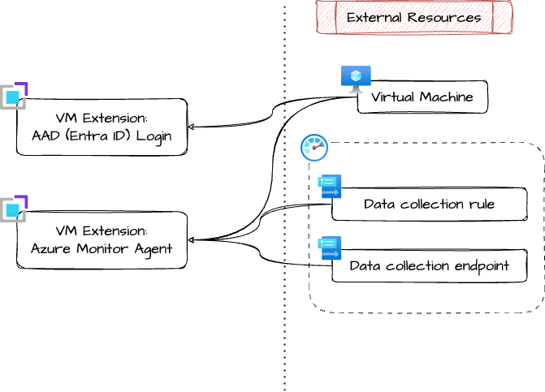

# Azure Linux Virtual Machine Extensions

Post-deploy extensions and configuration for Azure Linux virtual machines.

## Architecture

## Example usage

TODO

<!-- markdownlint-disable -->
<!-- BEGIN_TF_DOCS -->
## Requirements

| Name | Version |
|------|---------|
|  [terraform](#requirement\_terraform) | ~> 1.9 |
|  [azurerm](#requirement\_azurerm) | >= 3.116.0 |

## Providers

| Name | Version |
|------|---------|
|  [azurerm](#provider\_azurerm) | 4.33.0 |

## Modules

No modules.

## Resources

| Name | Type |
|------|------|
| [azurerm_monitor_data_collection_rule_association.dce_association](https://registry.terraform.io/providers/hashicorp/azurerm/latest/docs/resources/monitor_data_collection_rule_association) | resource |
| [azurerm_monitor_data_collection_rule_association.dcr_association](https://registry.terraform.io/providers/hashicorp/azurerm/latest/docs/resources/monitor_data_collection_rule_association) | resource |
| [azurerm_virtual_machine_extension.aad_ssh_login](https://registry.terraform.io/providers/hashicorp/azurerm/latest/docs/resources/virtual_machine_extension) | resource |
| [azurerm_virtual_machine_extension.azure_monitor_agent](https://registry.terraform.io/providers/hashicorp/azurerm/latest/docs/resources/virtual_machine_extension) | resource |
| [azurerm_virtual_machine_extension.key_vault](https://registry.terraform.io/providers/hashicorp/azurerm/latest/docs/resources/virtual_machine_extension) | resource |

## Inputs

| Name | Description | Type | Default | Required |
|------|-------------|------|---------|:--------:|
|  [aad\_ssh\_login](#input\_aad\_ssh\_login) | Azure AD (Entra ID) authentication extension | <pre>object({     enabled           = bool     extension_version = optional(string, "1.0")   })</pre> | <pre>{   "enabled": true }</pre> | no |
|  [azure\_monitor\_agent](#input\_azure\_monitor\_agent) | Azure Monitor Agent extension | <pre>object({     enabled                     = bool     extension_version           = optional(string, "1.33")     data_collection_rule_id     = optional(string, null)     data_collection_endpoint_id = optional(string, null)   })</pre> | <pre>{   "enabled": false }</pre> | no |
|  [key\_vault](#input\_key\_vault) | Key Vault extension for keeping certs in sync with Key Vault | <pre>object({     enabled                  = bool     vault_uri                = string     cert_name                = string     cert_store_location      = string     extension_version        = optional(string, "3.0")     polling_interval_seconds = optional(number, 3600)   })</pre> | <pre>{   "cert_name": "none",   "cert_store_location": "none",   "enabled": false,   "vault_uri": "none" }</pre> | no |
|  [tags](#input\_tags) | Tags of azure resources | `map(string)` | `{}` | no |
|  [virtual\_machine\_id](#input\_virtual\_machine\_id) | Resource ID of the virtual machine to extend | `string` | n/a | yes |

## Outputs

No outputs.
<!-- END_TF_DOCS -->
