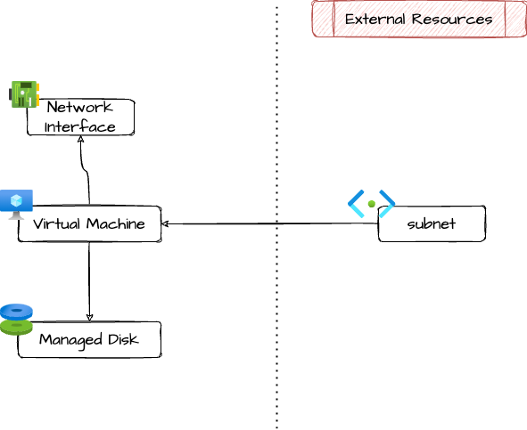

# Azure Migrated Virtual Machine

Module for quickly importing into Terraform and reconfiguring via
Terraform a virtual machine migrated to Azure with Azure Migrate.

This module has been tested with multiple VMware ESXI Linux virtual
machines, other hypervisors/os may need some tinkering with
properties.

> [!NOTE] 
> This module does not use the `azurerm_linux_virtual_machine`
> or `azurerm_windows_virtual_machine`, it uses the legacy
> `azurerm_virtual_machine` resource instead. This is because
> attaching managed disk is not supported in the new resources, but
> Azure Migrate works like that. Read
> [here](https://github.com/hashicorp/terraform-provider-azurerm/issues/7269#issuecomment-641737978)
> for details.

## Architecture



## Example usage

```terraform

locals {
  project = "exmp-d"
}

resource "azurerm_resource_group" "this" {
  name     = "${local.project}-rg"
  location = var.location
  tags     = var.tags
}

module "vnet" {
  source = "github.com/pagopa/terraform-azurerm-v3.git//virtual_network?ref=v8.44.3"

  name                = "${local.project}-vnet"
  location            = azurerm_resource_group.this.location
  resource_group_name = azurerm_resource_group.this.name
  address_space       = ["10.0.0.0/18"]
  tags                = var.tags
}

module "vm_snet" {
  source = "./modules/vm_subnet/"

  name                 = "${local.project}-vm-snet"
  address_prefixes     = ["10.0.0.0/24"]
  resource_group_name  = azurerm_resource_group.this.name
  location             = azurerm_resource_group.this.location
  virtual_network_name = module.vnet.name

  management_access = {
    type                        = "bastion"
    bastion_resource_group_name = "my-bastion-rg"
    bastion_vnet_name           = "my-bastion-vnet"
    ssh_enabled                 = true
  }
}

module "my_vm" {
  source = "./modules/migrated_linux_vm/"

  name                = "${local.project}-my-vm"
  location            = azurerm_resource_group.this.location
  resource_group_name = azurerm_resource_group.this.name
  subnet_id           = module.vm_snet.id
  size                = "Standard_D4as_v5"
  os_type             = "Linux"
  hyper_v_generation  = "V1"

  entra_id_ssh_login = {
    enabled                   = true
    admin_login_principal_ids = [data.azuread_group.adgroup_admin.object_id]
    # todo user login
  }

  tags = local.azure_migrate_tags
}
```

## Imports

In this migration scenario, you will need to import migrated resources
instead that creating them wuth Terraform. Following the example
above:

```terraform
import {
  to = module.vm_fe.azurerm_network_interface.this
  id = "/subscriptions/${data.azurerm_subscription.current.subscription_id}/resourceGroups/${local.project}-rg/providers/Microsoft.Network/networkInterfaces/nic-${local.project}-fe-vm-00"
}

import {
  to = module.vm_fe.azurerm_managed_disk.os
  id = "/subscriptions/${data.azurerm_subscription.current.subscription_id}/resourceGroups/${local.project}-rg/providers/Microsoft.Compute/disks/${local.project}-my-vm-OSdisk-00"
}

import {
  to = module.vm_fe.azurerm_virtual_machine.this
  id = "/subscriptions/${data.azurerm_subscription.current.subscription_id}/resourceGroups/${local.project}-rg/providers/Microsoft.Compute/virtualMachines/${local.project}-my-vm"
}

```

<!-- markdownlint-disable -->
<!-- BEGIN_TF_DOCS -->
## Requirements

| Name | Version |
|------|---------|
| <a name="requirement_terraform"></a> [terraform](#requirement\_terraform) | ~> 1.9 |
| <a name="requirement_azurerm"></a> [azurerm](#requirement\_azurerm) | >= 3.116.0 |

## Providers

| Name | Version |
|------|---------|
| <a name="provider_azurerm"></a> [azurerm](#provider\_azurerm) | 4.11.0 |

## Modules

No modules.

## Resources

| Name | Type |
|------|------|
| [azurerm_managed_disk.os](https://registry.terraform.io/providers/hashicorp/azurerm/latest/docs/resources/managed_disk) | resource |
| [azurerm_network_interface.this](https://registry.terraform.io/providers/hashicorp/azurerm/latest/docs/resources/network_interface) | resource |
| [azurerm_virtual_machine.this](https://registry.terraform.io/providers/hashicorp/azurerm/latest/docs/resources/virtual_machine) | resource |

## Inputs

| Name | Description | Type | Default | Required |
|------|-------------|------|---------|:--------:|
| <a name="input_disk_size_gb"></a> [disk\_size\_gb](#input\_disk\_size\_gb) | Size in GB of the OS disk | `string` | n/a | yes |
| <a name="input_hyper_v_generation"></a> [hyper\_v\_generation](#input\_hyper\_v\_generation) | Hyper-V generation, V1 or V2 | `string` | n/a | yes |
| <a name="input_identity"></a> [identity](#input\_identity) | Identity attached to the VM. Consider leaving the default SystemAssigned, handy in most cases | <pre>object({<br/>    type         = string<br/>    identity_ids = optional(set(string), null)<br/>  })</pre> | <pre>{<br/>  "identity_ids": null,<br/>  "type": "SystemAssigned"<br/>}</pre> | no |
| <a name="input_location"></a> [location](#input\_location) | Location | `string` | n/a | yes |
| <a name="input_name"></a> [name](#input\_name) | Name of the virtual machine | `string` | n/a | yes |
| <a name="input_os_type"></a> [os\_type](#input\_os\_type) | Type of OS | `string` | n/a | yes |
| <a name="input_resource_group_name"></a> [resource\_group\_name](#input\_resource\_group\_name) | Resource group name | `string` | n/a | yes |
| <a name="input_size"></a> [size](#input\_size) | Size of the VM | `string` | n/a | yes |
| <a name="input_storage_account_type"></a> [storage\_account\_type](#input\_storage\_account\_type) | Storage account type of the OS disk | `string` | `"StandardSSD_LRS"` | no |
| <a name="input_subnet_id"></a> [subnet\_id](#input\_subnet\_id) | Subnet in which the VM is deployed | `string` | n/a | yes |
| <a name="input_tags"></a> [tags](#input\_tags) | Tags of azure resources | `map(string)` | `{}` | no |

## Outputs

| Name | Description |
|------|-------------|
| <a name="output_id"></a> [id](#output\_id) | ID of the managed resource |
| <a name="output_private_ip_address"></a> [private\_ip\_address](#output\_private\_ip\_address) | Primary private ip address |
<!-- END_TF_DOCS -->
