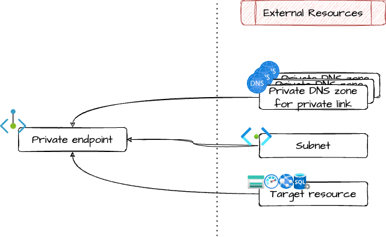

# Azure private endpoint

Easily setup a private endpoint automatically matching correct private DNS zones per service.
The private DNS zone MUST be pre-existing.

This is just an handy way to forget about the clumsy [private endpoints service names and associated private dns zones](https://learn.microsoft.com/en-us/azure/private-link/private-endpoint-dns).

You can use this module in sinergy with the [azure_private_link_dns_zones](../azure_private_link_dns_zones/) module.

## Architecture



## Managed services

Following Azure services are supported as private endpoint target:

* `AppService`
* `StorageBlob`
* `StorageDfs`
* `StorageFile`
* `StorageQueue`
* `StorageTable`
* `StorageWeb`
* `StorageAfs`
* `KeyVault`
* `MySQL`
* `SqlServer`
* `AzureMonitor`

This service names are the same as in [azure_private_link_dns_zones](../azure_private_link_dns_zones/) module.

## Example usage

Example for a storage account with blob and dfs endpoints.

```terraform
resource "azurerm_resource_group" "example" {
  name     = "example-rg"
  location = "West Europe"
}

resource "azurerm_virtual_network" "example" {
  name                = "virtnetname"
  address_space       = ["10.0.0.0/16"]
  location            = azurerm_resource_group.example.location
  resource_group_name = azurerm_resource_group.example.name
}

resource "azurerm_subnet" "example" {
  name                 = "subnetname"
  resource_group_name  = azurerm_resource_group.example.name
  virtual_network_name = azurerm_virtual_network.example.name
  address_prefixes     = ["10.0.2.0/24"]
}

# the target resource of the private endpoint
resource "azurerm_storage_account" "example" {
  name                     = "exampleaccount"
  resource_group_name      = azurerm_resource_group.example.name
  location                 = azurerm_resource_group.example.location
  account_tier             = "Standard"
  account_replication_type = "LRS"
}

# private dns zones for private endpoints
module "private_endpoint_dns_zones_storage" {
  source = "github.com/pagopa/ict-terraform-modules//azure_private_link_dns_zones?ref=v1.1.0"

  resource_group_name = azurerm_resource_group.example.name
  services            = ["StorageBlob", "StorageDfs"]
}

# bind them to the my vnet
resource "azurerm_private_dns_zone_virtual_network_link" "private_endpoint_dns_zones" {
  for_each = { for dns in module.private_endpoint_dns_zones.private_dns_zones : dns.name => dns }

  name                  = azurerm_virtual_network.example.name
  virtual_network_id    = azurerm_virtual_network.example.id
  resource_group_name   = each.value.resource_group_name
  private_dns_zone_name = each.value.name
}

# create private endpoints

module "private_endpoint_storage_blob" {
  source = "github.com/pagopa/ict-terraform-modules//azure_private_link_dns_zones?ref=v1.1.0"

  name                = "example-storage-blob-pep"
  location            = azurerm_resource_group.example.location
  resource_group_name = azurerm_resource_group.example.name
  subnet_id           = azurerm_subnet.example.id
  resource_id         = azurerm_storage_account.example.id
  service             = "StorageBlob"

  # this is MANDATORY! this module assumes the correct dns zones already exist
  depends_on = [module.private_endpoint_dns_zones["StorageBlob"]]
}

module "private_endpoint_storage_dfs" {
  source = "github.com/pagopa/ict-terraform-modules//azure_private_link_dns_zones?ref=v1.1.0"

  name                = "example-storage-dfs-pep"
  location            = azurerm_resource_group.example.location
  resource_group_name = azurerm_resource_group.example.name
  subnet_id           = azurerm_subnet.example.id
  resource_id         = azurerm_storage_account.example.id
  service             = "StorageDfs"

  # this is MANDATORY! this module assumes the correct dns zones already exist
  depends_on = [module.private_endpoint_dns_zones["StorageDfs"]]
}
```

<!-- markdownlint-disable -->
<!-- BEGIN_TF_DOCS -->
## Requirements

| Name | Version |
|------|---------|
| <a name="requirement_terraform"></a> [terraform](#requirement\_terraform) | ~> 1.9 |
| <a name="requirement_azurerm"></a> [azurerm](#requirement\_azurerm) | >= 3.116.0 |

## Providers

| Name | Version |
|------|---------|
| <a name="provider_azurerm"></a> [azurerm](#provider\_azurerm) | >= 3.116.0 |

## Modules

No modules.

## Resources

| Name | Type |
|------|------|
| [azurerm_private_endpoint.this](https://registry.terraform.io/providers/hashicorp/azurerm/latest/docs/resources/private_endpoint) | resource |
| [azurerm_private_dns_zone.private_endpoint](https://registry.terraform.io/providers/hashicorp/azurerm/latest/docs/data-sources/private_dns_zone) | data source |

## Inputs

| Name | Description | Type | Default | Required |
|------|-------------|------|---------|:--------:|
| <a name="input_dns_zone_resource_group_name"></a> [dns\_zone\_resource\_group\_name](#input\_dns\_zone\_resource\_group\_name) | Name of the resource group where the private DNS zone associated with the endpoint resides. If null, it will be searched in the same resource group where the private endpoint is about to be created | `string` | `null` | no |
| <a name="input_location"></a> [location](#input\_location) | Location of the managed private endpoint | `string` | n/a | yes |
| <a name="input_name"></a> [name](#input\_name) | Name of the managed private endpoint | `string` | n/a | yes |
| <a name="input_resource_group_name"></a> [resource\_group\_name](#input\_resource\_group\_name) | Resource group name | `string` | n/a | yes |
| <a name="input_resource_id"></a> [resource\_id](#input\_resource\_id) | ID of the resource exposed by the private endpoint | `string` | n/a | yes |
| <a name="input_service"></a> [service](#input\_service) | Name of the service exposed by the private endpoint | `string` | n/a | yes |
| <a name="input_subnet_id"></a> [subnet\_id](#input\_subnet\_id) | ID of the subnet where to place the private endpoint | `string` | n/a | yes |
| <a name="input_tags"></a> [tags](#input\_tags) | Tags of azure resources | `map(string)` | `{}` | no |

## Outputs

| Name | Description |
|------|-------------|
| <a name="output_private_ip"></a> [private\_ip](#output\_private\_ip) | Private IP of the private endpoint |
<!-- END_TF_DOCS -->
