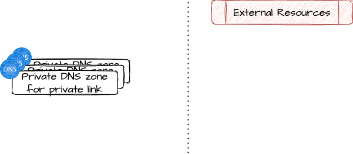

# Azure private link DNS zones

Easily setup private DNS zones for private link on a per-service
basis.  More details in [official docs](https://learn.microsoft.com/en-us/azure/private-link/private-endpoint-dns).

You can use this module in sinergy with the [azure_private_endpoint](../azure_private_endpoint/) module.

## Architecture



## Managed services

Following Azure services are supported as private endpoint target:

* `AppService`
* `StorageBlob`
* `StorageDfs`
* `StorageFile`
* `StorageQueue`
* `StorageTable`
* `StorageWeb`
* `StorageAfs`
* `KeyVault`
* `MySQL`
* `SqlServer`
* `AzureMonitor`

This service names are the same as in [azure_private_endpoint](../azure_private_endpoint/) module.

## Example usage

Example for a storage account with blob and dfs endpoints.

```terraform
resource "azurerm_resource_group" "example" {
  name     = "example-rg"
  location = "West Europe"
}

resource "azurerm_virtual_network" "example" {
  name                = "virtnetname"
  address_space       = ["10.0.0.0/16"]
  location            = azurerm_resource_group.example.location
  resource_group_name = azurerm_resource_group.example.name
}

resource "azurerm_subnet" "example" {
  name                 = "subnetname"
  resource_group_name  = azurerm_resource_group.example.name
  virtual_network_name = azurerm_virtual_network.example.name
  address_prefixes     = ["10.0.2.0/24"]
}

# the target resource of the private endpoint
resource "azurerm_storage_account" "example" {
  name                     = "exampleaccount"
  resource_group_name      = azurerm_resource_group.example.name
  location                 = azurerm_resource_group.example.location
  account_tier             = "Standard"
  account_replication_type = "LRS"
}

# private dns zones for private endpoints
module "private_endpoint_dns_zones_storage" {
  source = "github.com/pagopa/ict-terraform-modules//azure_private_link_dns_zones?ref=v1.1.0"

  resource_group_name = azurerm_resource_group.example.name
  services            = ["StorageBlob", "StorageDfs"]
}

# bind them to the my vnet
resource "azurerm_private_dns_zone_virtual_network_link" "private_endpoint_dns_zones" {
  for_each = { for dns in module.private_endpoint_dns_zones.private_dns_zones : dns.name => dns }

  name                  = azurerm_virtual_network.example.name
  virtual_network_id    = azurerm_virtual_network.example.id
  resource_group_name   = each.value.resource_group_name
  private_dns_zone_name = each.value.name
}

# create private endpoints

module "private_endpoint_storage_blob" {
  source = "github.com/pagopa/ict-terraform-modules//azure_private_link_dns_zones?ref=v1.1.0"

  name                = "example-storage-blob-pep"
  location            = azurerm_resource_group.example.location
  resource_group_name = azurerm_resource_group.example.name
  subnet_id           = azurerm_subnet.example.id
  resource_id         = azurerm_storage_account.example.id
  service             = "StorageBlob"

  # this is MANDATORY! this module assumes the correct dns zones already exist
  depends_on = [module.private_endpoint_dns_zones["StorageBlob"]]
}

module "private_endpoint_storage_dfs" {
  source = "github.com/pagopa/ict-terraform-modules//azure_private_link_dns_zones?ref=v1.1.0"

  name                = "example-storage-dfs-pep"
  location            = azurerm_resource_group.example.location
  resource_group_name = azurerm_resource_group.example.name
  subnet_id           = azurerm_subnet.example.id
  resource_id         = azurerm_storage_account.example.id
  service             = "StorageDfs"

  # this is MANDATORY! this module assumes the correct dns zones already exist
  depends_on = [module.private_endpoint_dns_zones["StorageDfs"]]
}
```

<!-- markdownlint-disable -->
<!-- BEGIN_TF_DOCS -->
## Requirements

| Name | Version |
|------|---------|
| <a name="requirement_terraform"></a> [terraform](#requirement\_terraform) | ~> 1.9 |
| <a name="requirement_azurerm"></a> [azurerm](#requirement\_azurerm) | >= 3.116.0 |

## Providers

| Name | Version |
|------|---------|
| <a name="provider_azurerm"></a> [azurerm](#provider\_azurerm) | >= 3.116.0 |

## Modules

No modules.

## Resources

| Name | Type |
|------|------|
| [azurerm_private_dns_zone.this](https://registry.terraform.io/providers/hashicorp/azurerm/latest/docs/resources/private_dns_zone) | resource |

## Inputs

| Name | Description | Type | Default | Required |
|------|-------------|------|---------|:--------:|
| <a name="input_resource_group_name"></a> [resource\_group\_name](#input\_resource\_group\_name) | Resource group name | `string` | n/a | yes |
| <a name="input_services"></a> [services](#input\_services) | Azure services for which to create a private DNS zone for private endpoints | `list(string)` | n/a | yes |
| <a name="input_tags"></a> [tags](#input\_tags) | Tags of azure resources | `map(string)` | `{}` | no |

## Outputs

| Name | Description |
|------|-------------|
| <a name="output_private_dns_zones"></a> [private\_dns\_zones](#output\_private\_dns\_zones) | Private DNS zones managed |
<!-- END_TF_DOCS -->
