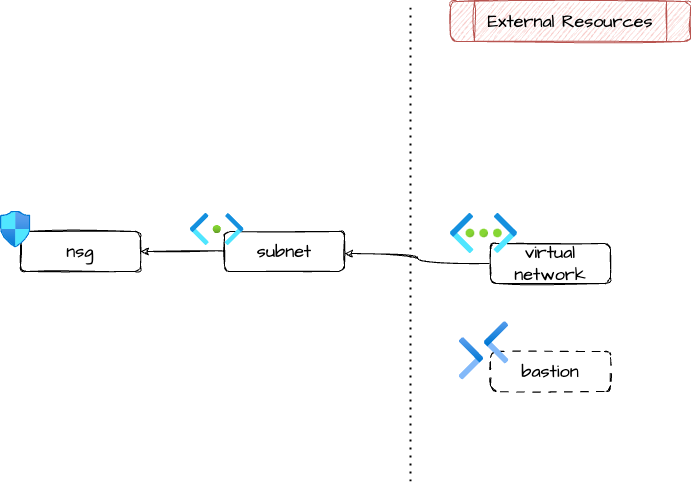

# Azure Virtual Machine Subnet

Terraform module that manages a subnet taylored for securely deploying
one or more Azure VMs or VM Scale Sets.

The subnet is shipped with a pre-configured Network Security Group
with opinionated rules.

## Architecture



## Example usage

```terraform
locals {
  project = "exmp-d"
}

resource "azurerm_resource_group" "this" {
  name     = "${local.project}-rg"
  location = var.location
  tags     = var.tags
}

module "vnet" {
  source = "github.com/pagopa/terraform-azurerm-v3.git//virtual_network?ref=v8.44.3"

  name                = "${local.project}-vnet"
  location            = azurerm_resource_group.this.location
  resource_group_name = azurerm_resource_group.this.name
  address_space       = ["10.0.0.0/18"]
  tags                = var.tags
}

module "vm_snet" {
  source = "./modules/vm_subnet/"

  name                 = "${local.project}-vm-snet"
  address_prefixes     = ["10.0.0.0/24"]
  resource_group_name  = azurerm_resource_group.this.name
  location             = azurerm_resource_group.this.location
  virtual_network_name = module.vnet.name

  management_access = {
    type                        = "Bastion"
    bastion_resource_group_name = "my-bastion-rg"
    bastion_vnet_name           = "my-bastion-vnet"
    ssh_enabled                 = true
  }

  exposed_services = [
    {
      name                    = "Https"
      protocol                = "Tcp"
      port                    = "443"
      source_name             = "AppGateway"
      source_address_prefixes = azurerm_subnet.application_gateway.address_prefixes
      destination_address_prefixes = ["only ip of some of my vms"]
    },
    {
      name                    = "CheckMKAgent"
      protocol                = "Tcp"
      port                    = "6556"
      source_name             = "CheckMK"
      source_address_prefix   = "the ip of checkmk"
    },
  ]
}
```

## Inbound connectivity and SSH/RDP access

SSH and/or RDP access for management must be configured in one of the following ways:

- **Bastion**. Allow remote access only by a Bastion subnet.
- **Public**. Allow public remote access. :warning: this is not safe!
  Only to be used temporarily for development.
- **IpRanges**. Specify CIDRs that can access remotely.
  
Obviously, access via Bastion is advised.

Every other inbound connection is by default denied. See use the
`exposed_services` variable for allowing inbound connections to
specified services.

## What about outbound traffic?

No rule is specified on outbound traffic.  If you want to add some
outbound rules, add them to the nsg like this:

```terraform
module "vm_snet" {
  source = "./modules/vm_subnet/"

  name                 = "${local.project}-vm-snet"
  address_prefixes     = ["10.0.0.0/24"]
  resource_group_name  = azurerm_resource_group.this.name
  location             = azurerm_resource_group.this.location
  virtual_network_name = module.vnet.name

  management_access = {
    type                        = "bastion"
    bastion_resource_group_name = "my-bastion-rg"
    bastion_vnet_name           = "my-bastion-vnet"
    ssh_enabled                 = true
  }
}

# deny all outbound tcp traffic
resource "azurerm_network_security_rule" "outbound_deny_all" {
  network_security_group_name = module.vm_snet.network_security_group_name
  resource_group_name         = azurerm_resource_group.this.name

  name                       = "Outbound_Deny_All"
  priority                   = 1000
  direction                  = "Outbound"
  access                     = "Deny"
  protocol                   = "Tcp"
  source_port_range          = "*"
  destination_port_range     = "*"
  source_address_prefixes    = azurerm_subnet.this.address_prefixes
  destination_address_prefix = "*"
}
```

<!-- markdownlint-disable -->
<!-- BEGIN_TF_DOCS -->
## Requirements

| Name | Version |
|------|---------|
| <a name="requirement_terraform"></a> [terraform](#requirement\_terraform) | ~> 1.9 |
| <a name="requirement_azurerm"></a> [azurerm](#requirement\_azurerm) | >= 3.116.0 |

## Providers

| Name | Version |
|------|---------|
| <a name="provider_azurerm"></a> [azurerm](#provider\_azurerm) | 4.29.0 |

## Modules

No modules.

## Resources

| Name | Type |
|------|------|
| [azurerm_network_security_group.this](https://registry.terraform.io/providers/hashicorp/azurerm/latest/docs/resources/network_security_group) | resource |
| [azurerm_network_security_rule.inbound_allow_rdp](https://registry.terraform.io/providers/hashicorp/azurerm/latest/docs/resources/network_security_rule) | resource |
| [azurerm_network_security_rule.inbound_allow_service](https://registry.terraform.io/providers/hashicorp/azurerm/latest/docs/resources/network_security_rule) | resource |
| [azurerm_network_security_rule.inbound_allow_ssh](https://registry.terraform.io/providers/hashicorp/azurerm/latest/docs/resources/network_security_rule) | resource |
| [azurerm_network_security_rule.inbound_allow_subnet_self](https://registry.terraform.io/providers/hashicorp/azurerm/latest/docs/resources/network_security_rule) | resource |
| [azurerm_network_security_rule.inbound_deny_all](https://registry.terraform.io/providers/hashicorp/azurerm/latest/docs/resources/network_security_rule) | resource |
| [azurerm_subnet.this](https://registry.terraform.io/providers/hashicorp/azurerm/latest/docs/resources/subnet) | resource |
| [azurerm_subnet_network_security_group_association.this](https://registry.terraform.io/providers/hashicorp/azurerm/latest/docs/resources/subnet_network_security_group_association) | resource |
| [azurerm_subnet.bastion](https://registry.terraform.io/providers/hashicorp/azurerm/latest/docs/data-sources/subnet) | data source |

## Inputs

| Name | Description | Type | Default | Required |
|------|-------------|------|---------|:--------:|
| <a name="input_address_prefixes"></a> [address\_prefixes](#input\_address\_prefixes) | n/a | `list(string)` | n/a | yes |
| <a name="input_exposed_services"></a> [exposed\_services](#input\_exposed\_services) | Services that are exposed by the subnet and allowed in vnet | <pre>list(object({<br/>    name                         = string<br/>    protocol                     = string<br/>    source_port_range            = optional(string, "*")<br/>    port                         = string<br/>    source_name                  = string<br/>    source_address_prefix        = optional(string, null)<br/>    source_address_prefixes      = optional(list(string), null)<br/>    destination_address_prefixes = optional(list(string), null)<br/>  }))</pre> | `[]` | no |
| <a name="input_location"></a> [location](#input\_location) | Location | `string` | n/a | yes |
| <a name="input_management_access"></a> [management\_access](#input\_management\_access) | Remote access for management of the VMs in the subnet | <pre>object({<br/>    type                        = string<br/>    ssh_enabled                 = optional(bool, false)<br/>    rdp_enabled                 = optional(bool, false)<br/>    bastion_vnet_name           = optional(string, null)<br/>    bastion_resource_group_name = optional(string, null)<br/>    ip_ranges                   = optional(list(string), [])<br/>  })</pre> | n/a | yes |
| <a name="input_name"></a> [name](#input\_name) | Name of the subnet | `string` | n/a | yes |
| <a name="input_resource_group_name"></a> [resource\_group\_name](#input\_resource\_group\_name) | Resource group name | `string` | n/a | yes |
| <a name="input_tags"></a> [tags](#input\_tags) | Tag of azure resources | `map(string)` | `{}` | no |
| <a name="input_virtual_network_name"></a> [virtual\_network\_name](#input\_virtual\_network\_name) | n/a | `string` | n/a | yes |

## Outputs

| Name | Description |
|------|-------------|
| <a name="output_address_prefixes"></a> [address\_prefixes](#output\_address\_prefixes) | Address prefixes of the managed VM subnet |
| <a name="output_id"></a> [id](#output\_id) | Id of the managed VM subnet |
| <a name="output_network_security_group_id"></a> [network\_security\_group\_id](#output\_network\_security\_group\_id) | Id of the network security group attached to the subnet |
| <a name="output_network_security_group_name"></a> [network\_security\_group\_name](#output\_network\_security\_group\_name) | Name of the network security group attached to the subnet |
<!-- END_TF_DOCS -->
